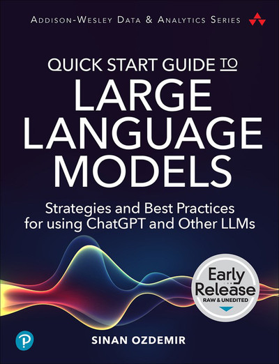

# Quick Start Guide to Large Language Models

[Get your copy today!](https://learning.oreilly.com/library/view/quick-start-guide/9780138199425/)

Welcome to the GitHub repository for the "Quick Start Guide to Large Language Models" book. This repository contains the code snippets and notebooks used in the book, demonstrating various applications of Transformer models.

## Repository Structure

* `notebooks`: This directory contains Jupyter notebooks for each chapter in the book. Notebooks include:
    * `2_semantic_search.ipynb`: An introduction to semantic search using transformer models.
    * `3_prompt_engineering.ipynb`: A guide to effective prompt engineering for transformer models.
    * And many others to come, exploring topics like fine-tuning, advanced prompt engineering, combining transformers, and various use-cases.
* `data`: Contains the datasets used in the notebooks.
* `images`: Contains images and graphs used in the notebooks.

## How to Use

To use this repository, clone it to your local machine, navigate to the notebooks directory, and open the Jupyter notebook of your choice. Note that some notebooks may require specific datasets, which can be found in the `data` directory.

Please ensure that you have the necessary libraries installed and that they are up to date. This can usually be done by running `pip install -r requirements.txt` in the terminal.

## Contributing

Contributions are welcome! Feel free to submit a pull request if you have any additions, corrections, or enhancements to submit.

## Disclaimer

This repository is for educational purposes and is meant to accompany the "Quick Start Guide to Large Language Models" book. Please refer to the book for in-depth explanations and discussions of the topics covered in the notebooks.
